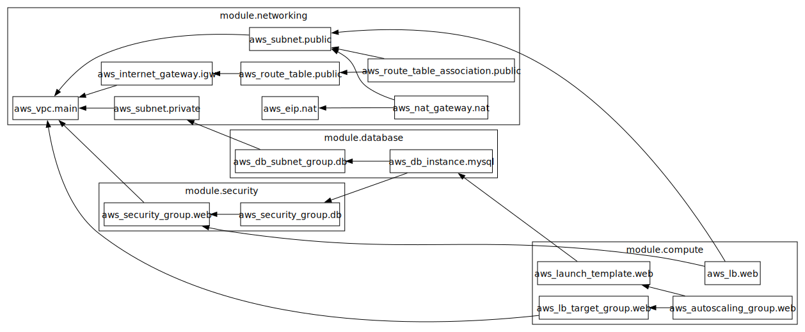

# Terraform 3 tier app

## architecture

 


A production-ready 3-tier AWS infrastructure deployed with Terraform, featuring:
- **VPC Networking** with public/private subnets
- **Auto-Scaling Web Tier** behind Application Load Balancer
- **Managed RDS Database** in private subnets
- **Security Best Practices** (least privilege IAM, security groups)

## Architecture Diagram


## Features

✅ **Infrastructure as Code**  
- Complete AWS environment defined in Terraform (VPC, EC2, RDS, ALB)  
- Modular design for reusability  

✅ **Operational Excellence**  
- Auto-scaling group (2-4 EC2 instances)  
- CloudWatch monitoring alarms  
- Zero-downtime deployments  

✅ **Security**  
- Database isolated in private subnets  
- Encrypted RDS storage  
- Restricted security group rules  

✅ **Cost Optimized**  
- Spot instance support (savings up to 70%)


## Prerequisites

- Terraform >= 1.3.0
- AWS account with IAM permissions
- AWS CLI configured (`aws configure`)

### Github Actions

Secure infrastructure deployment pipeline for AWS 3-tier architecture using Terraform and GitHub Actions OIDC.

- remenber to set the secrets directly in your github account. the Name should be: AWS_IAM_ROLE , and get the value from your aws account

## Features

✅ **Zero-Secret Deployment**  
- Uses GitHub OIDC for AWS authentication (no stored credentials)  
- IAM role with least-privilege permissions  

✅ **Automated Validation**  
- Terraform init/fmt/validate/ on every push  
- Plan output in PR comments  

# Note

- I ommitted terraform plan because we will need to set the db_credentials


### Deployment

```bash
terraform init
terraform plan
terraform apply


